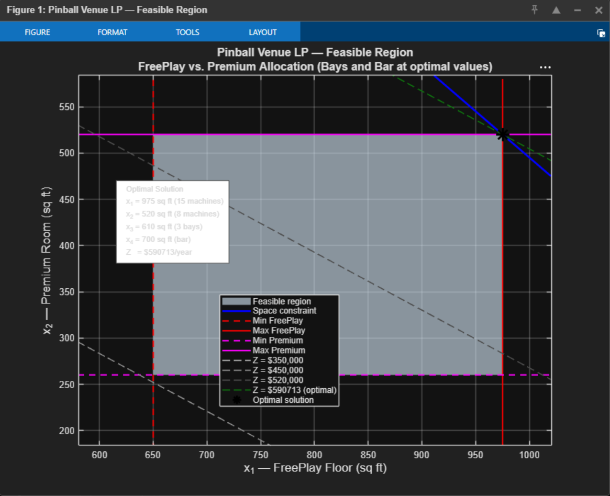

# Floor Space Optimization for a Multi-Tier Pinball Venue
### A Linear Programming Application

> Given a fixed 3,500 sq ft venue, how should space be allocated across four revenue-generating zones to maximize annual gross revenue?

This project applies linear programming to a real business planning problem for a proposed premium pinball venue. It was developed in three sequential phases: interactive simulation, business analysis, and formal LP optimization, with each phase informing the next. The LP did not produce a surprising result; it produced a formally verified confirmation of a conclusion the prior simulation had already reached, which is what a well-formulated optimization model should do.

---

## Skills Demonstrated

- **Linear programming** — objective function derivation, constraint modeling, MATLAB `linprog` (dual-simplex)
- **Revenue coefficient derivation** — translating operational parameters into $/sq ft/year coefficients
- **Constraint analysis** — identifying binding vs. slack constraints and their business interpretation
- **2D feasible region visualization** — iso-revenue contour lines, corner-point optimality
- **Interactive front-end prototyping** — HTML5 Canvas floor plan, vanilla JS, real-time revenue output
- **Technical writing** — model documentation, limitations analysis, academic write-up

---

## Repository Contents

| File | Description |
|---|---|
| `matlab/pinball_venue_lp.m` | MATLAB LP formulation, solver, and feasible region plot |
| `simulator/pinball_venue_floor_simulator.html` | Interactive pre-LP simulator: open directly in any browser, no install needed |
| `paper/Pinball_Venue_LP_Paper.pdf` | Full write-up: model derivation, solution, conclusion, limitations |
| `figures/feasible_region.png` | MATLAB plot: feasible region for FreePlay vs. Premium allocation |

---

## Problem Setup

The venue is structured around four competing zones, each with a distinct revenue model:

| Zone | Revenue Mechanism |
|---|---|
| **FreePlay floor** | Flat daily entry fee; revenue scales with visitors, not machine count |
| **Premium room** | $1/game on high-condition machines; per-visitor spend ~$8 blended |
| **Private rental bays** | Hourly group bookings; revenue ceiling determined by bookable hours and demand |
| **Bar + entry** | Per-visitor beverage spend; highest revenue-per-sq-ft of all four zones |

**Effective allocatable space** after fixed deductions:

```
S_eff = (3500 / 1.12) − 320 ≈ 2,805 sq ft
```

- 12% circulation factor (premium spacing standard)
- 320 sq ft back of house (machine storage, repairs, liquor and ops storage) — fixed, not optimized

Each machine is allocated **65 sq ft** (vs. the 50 sq ft arcade standard), reflecting premium clearance for comfortable play, nudging, spectating, and aisle traffic.

---

## LP Formulation

**Decision variables:**
- `x₁` = sq ft allocated to FreePlay floor
- `x₂` = sq ft allocated to Premium room
- `x₃` = sq ft allocated to Private bays
- `x₄` = sq ft allocated to Bar + entry + bathrooms

**Objective function** — maximize annual gross revenue:

```
Maximize Z = 186.67x₁ + 298.67x₂ + 50.88x₃ + 317.67x₄
```

**Constraints:**

```
x₁ + x₂ + x₃ + x₄ ≤ 2,805       (total space)

650 ≤ x₁ ≤ 975                    (10–15 FreePlay machines × 65 sq ft)
260 ≤ x₂ ≤ 520                    (4–8 Premium machines × 65 sq ft)
  0 ≤ x₃ ≤ 1,760                  (0–8 bays × 220 sq ft)
400 ≤ x₄ ≤ 700                    (functional bar minimum to maximum)
```

Revenue coefficients ($/sq ft/year) are derived from fixed operational parameters — 40 average daily visitors, 364 operating days, $12.50 entry fee, $8.00 blended premium spend, $12.00 average bar spend, $95 average bay booking rate at 50% utilization.

---

## Results

Bar ($317.67/sq ft) and Premium ($298.67/sq ft) have the highest revenue coefficients and reach their upper bounds first. FreePlay also reaches its upper bound, entry fee revenue is attributed to this zone in full. Bays ($50.88/sq ft) receive only what remains.

| Zone | Optimal Allocation | Annual Revenue | % of Total |
|---|---|---|---|
| FreePlay floor (x₁) | 975 sq ft — 15 machines | $182,000 | 30.8% |
| Premium room (x₂) | 520 sq ft — 8 machines | $155,307 | 26.3% |
| Private bays (x₃) | 610 sq ft — 3 bays | $31,035 | 5.3% |
| Bar + entry (x₄) | 700 sq ft | $222,371 | 37.6% |
| Back of house | 320 sq ft (fixed) | — | — |
| **Total** | **3,125 sq ft** | **$590,713** | **100%** |

Bar and entry fees together account for **68.4% of total revenue**. Bays contribute only 5.3% despite requiring 610 sq ft of dedicated build-out, confirming the structural revenue ceiling the pre-LP simulation had already identified.

### Feasible Region

The plot below shows the 2D feasible region for `x₁` (FreePlay) vs. `x₂` (Premium), with bays and bar fixed at their optimal values. The optimal corner point at (975, 520) is where the Max FreePlay, Max Premium, and space constraints are simultaneously binding.



---

## How to Run

**MATLAB (LP solver + feasible region plot):**
```matlab
% Requires: Optimization Toolbox (linprog)
% Tested on MATLAB R2021a and later
run('pinball_venue_lp.m')
```

**Interactive floor simulator:**
```
Open pinball_venue_floor_simulator.html in any modern browser.
No installation, no dependencies, no server required.
```
Adjust machine counts, bay count, visitor assumptions, and total sq ft to see real-time space allocation and annual revenue output.

---

## Limitations

The most significant limitation is that bay revenue is modeled as linear in square footage. In practice, bays have a hard ceiling determined by bookable hours and demand, a non-linearity the pre-LP simulator explicitly demonstrated. A more rigorous treatment would require piecewise linear approximation or non-linear programming.

Visitor count is treated as a fixed parameter rather than a function of venue configuration, which understates the feedback between floor quality and attendance. All coefficients are derived from modeled estimates and should be validated against real location-specific inputs before use in a formal financial projection.

---

## Background

This project was developed during an extended business planning process for a proposed pinball venue; formalized as a final project for a Math Optimization course. The business planning context preceded the formal LP treatment: the interactive simulator and revenue model were built first, and the LP formalization followed. Three independent analytical approaches (simulation, business reasoning, and LP optimization) converged on the same structural conclusion, which is the strongest validation available at a pre-operational planning stage.

---

*MATLAB R2021a · Optimization Toolbox · HTML5 / Vanilla JS*
